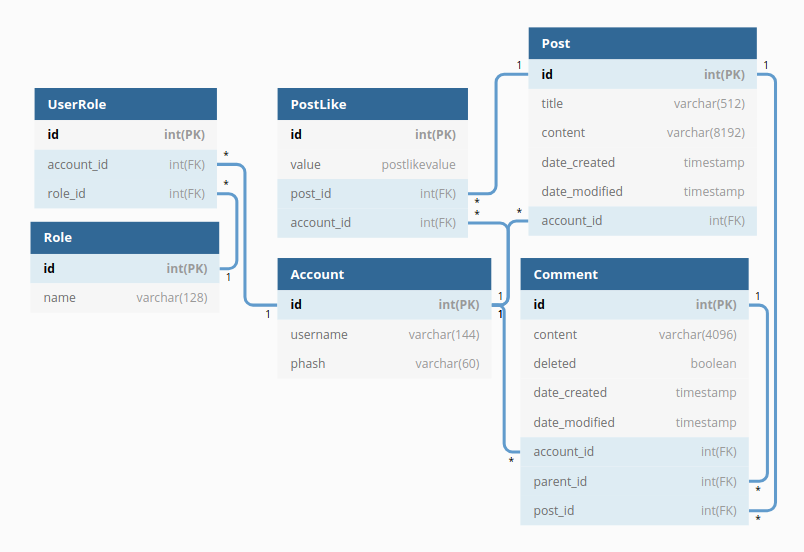

# inoolktidder
Tietokantasovellus, 2019

# Kuvaus

Reddit-tyylinen julkinen keskustelufoorumi, jossa kuka tahansa sisään kirjautunut käyttäjä voi luoda postauksia sekä kommentoida niihin ja antaa niille tykkäyksiä. Postaukset näytetään listamuodossa heti etusivulla. Postauksia voi luonnollisesti klikata, jotta saadaan näkyviin niiden sisältö ja niihin luodut kommentit. Kommentteja voi luoda myös vastauksena muihin kommentteihin, jolloin niistä muodostuu esitysmuotonsa ansiosta kommenttiketjuja.

# Heroku-demo

[Tidd3r](https://tidd3r.herokuapp.com/)

# Tietokantakaavio

# User storyt

- User can add a post
- User can view all posts
- User can like posts
- User can view content of a post
- User can edit the title and contents of a post

# Testitunnukset

username: hello, password: world
username: test, password: password