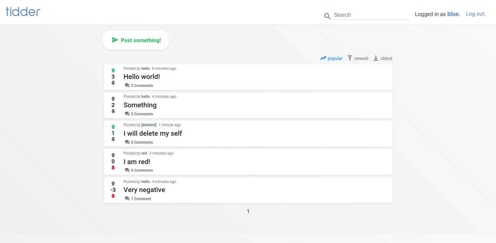

# Tidd3r

## Kuvaus

Tarkoituksena oli luoda redditin tapainen keskustelufoorumi, jossa käyttäjät voivat luoda kaikille näkyviä postauksia, joille voi antaa tykkäyksiä tai kommentteja. Näitä postauksia voi ruveta selaamaan heti etusivulta ja niiden sisältöön sekä kommenttiosioon pääsee otsikkoa klikkaamalla.

Iso osa reddittiä on kommenttien hierarkkinen esitysmuoto, joka on käytössä myös tässä sovelluksessa. Kommentteja voi luoda joko suoraan postauksiin tai vastauksena toisiin kommentteihin.

Jokainen käyttäjä voi myös antaa yhden plus- tai miinuspisteen postausta kohti. Postaukset järjestetään oletusarvoisesti näiden pisteiden summan avulla, joten toiminnolla on merkitystä postausten näkyvyyden kannalta.


## [Demo](https://tidd3r.herokuapp.com/)



### Demon testitunnukset

| Käyttäjänimi  | Salasana |
|---------------|----------|
| hello         | world    |
| red           | world    |
| blue          | world    |

## Käyttöohje

### Käyttäjä

- Linkit kirjautumiseen ja rekisteröitymiseen löytyvät oikeasta yläkulmasta.
- Rekisteröityminen vaatii vain uniikin käyttäjänimen sekä salasanan, joista molempien täytyy olla vähintään 3 merkkiä pitkiä.
- Omaan profiiliin pääsee klikkaamalla oikealla yläkulmassa oman käyttäjän nimeä.
- Profiilista voi vaihtaa käyttäjänimen 'edit'-linkin avulla tai salasanan käyttäjänimen alapuolella olevan lomakkeen avulla.
- Käyttäjänsä voi poistaa _Delete_-linkistä.

> **Huom.** Oman käyttäjän poistaminen ei poista käyttäjän tekemiä postauksia tai kommentteja. Poistetun käyttäjän postausten ja kommenttien käyttäjänimen tilalla näytetään _[deleted]_.

### Postaukset

- Muiden postausten tarkempaan näkymään pääsee klikkaamalla niiden otsikkoa. **Vihje:** Painamalla _comments_-linkkiä pääset suoraan kommenttiosioon.
- Linkki oman postauksen luomiseen on etusivulla, muiden postausten yläpuolella.
- Postauksen luonti tapahtuu antamalla vähintään 3-merkkisen otsikon sekä vaihtoehtoisesti myös sisällön ja painamalla _Submit!_.
- Omia postauksia voi editoida käyttämällä _Edit_-linkkiä etusivulla tai postauksen tarkemmassa näkymässä.
- Samaten poistaminen onnistuu _Edit_-linkin vieressä olevalla _Delete_-linkillä.

### Kommentit

- Kommentin luominen onnistuu kun postauksen tarkempaan näkymään on siirrytty etusivulta. Kommentin tekstikenttä löytyy joko suoraan postauksen alapuolelta tai ilmestyy klikkaamalla _Reply_-linkkiä missä tahansa kommentissa.
- Oman kommentin editointi ja poistaminen tapahtuu sen sisällön alapuolella olevilla _Edit_ ja _Delete_ linkeillä.

> **Huom.** Kommentin poistaminen ei oikeasti poista kommenttia tietokannasta vaan asettaan sen attribuutin `deleted` arvoksi `True`, jolloin kommentin sisällön tilalla näytetään _[deleted]_.

### Muut toiminnallisuudet

- Postauksia voi järjestää niiden listauksen oikealla yläpuolella olevista linkeistä. Vaihtoehtoina on _popular_, _newest_ ja _oldest_.
- Etsintäpalkki on oikeassa yläkulmassa. Etsiminen on rajoitettu postausten otsikkoihin.
- Sivujen navigaatio löytyy etusivulta postausten alapuolelta.


## Asennusohje Linuxille

```bash
curl -LO https://github.com/esksami/inoolktidder/archive/master.zip
unzip master.zip; rm master.zip
cd inoolktidder-master/
python3 -m venv venv
source venv/bin/activate
pip install -r requirements.txt
python run.py
```
Sovellus löytyy selaimella osoitteesta http://localhost:5000.

## Rajoitteet ja jatkokehitysideat

- Kommentteja ei voi vielä äänestää. Tämä olisi helppo lisäys jos ottaa mallia postauksista.
- Kommentteja haetaan tällä hetkellä ensimmäiset 100, eikä niitä voi hakea enempää. Kommenttien alapuolella pitäisi näyttää _show more_-linkki, jos niille löytyy lisää vastauksia tietokannasta.
- Kommentteja pitäisi pystyä järjestämään kuten postauksiakin.
- Postaukset voisi rajata tietylle aikavälille, ettei samoja postauksia tarvitse selata viikosta toiseen kun järjestyksenä on _popular_.
- Postauksien otsikon ja sisällön prosessointi markdownina
- Postausiin ja kommentteihin voisi laittaa _\*_ -merkin, jos niitä on editoitu.
- Vaikka roolit on toteutettu sovelluksessa niitä ei hyödynnetä. _Moderaattori_-ryhmään kuuluville voisi antaa toiminnalisuuden käyttäjien estämiseksi ja _Admin_-ryhmään kuuluville mahdollisuudet käyttäjien poistamiseen.

## Tietokantarakenteen kuvaus

### Tietokantakaavio


### SQL


```sql
CREATE TABLE account (
    id SERIAL NOT NULL, 
    username VARCHAR(144) NOT NULL, 
    phash VARCHAR(60) NOT NULL, 
    PRIMARY KEY (id), 
    UNIQUE (username)
)

CREATE TABLE post (
    id SERIAL NOT NULL, 
    date_created TIMESTAMP WITHOUT TIME ZONE, 
    date_modified TIMESTAMP WITHOUT TIME ZONE, 
    title VARCHAR(512) NOT NULL, 
    content VARCHAR(8192) NOT NULL, 
    account_id INTEGER, 
    PRIMARY KEY (id), 
    FOREIGN KEY (account_id) REFERENCES account(id)
)

CREATE TYPE postlikevalue AS ENUM ('dislike', 'like')

CREATE TABLE post_like (
    id SERIAL NOT NULL, 
    value postlikevalue NOT NULL, 
    post_id INTEGER, 
    account_id INTEGER, 
    PRIMARY KEY (id), 
    UNIQUE (post_id, account_id), 
    FOREIGN KEY (post_id) REFERENCES post(id), 
    FOREIGN KEY (account_id) REFERENCES account(id)
)

CREATE TABLE comment (
    id SERIAL NOT NULL, 
    date_created TIMESTAMP WITHOUT TIME ZONE, 
    date_modified TIMESTAMP WITHOUT TIME ZONE, 
    content VARCHAR(4096), 
    account_id INTEGER, 
    post_id INTEGER NOT NULL, 
    parent_id INTEGER, 
    deleted BOOLEAN NOT NULL, 
    PRIMARY KEY (id), 
    FOREIGN KEY (account_id) REFERENCES account(id), 
    FOREIGN KEY (post_id) REFERENCES post(id), 
    FOREIGN KEY (parent_id) REFERENCES comment(id)
)

CREATE TABLE role (
    id SERIAL NOT NULL, 
    name VARCHAR(128), 
    PRIMARY KEY (id), 
    UNIQUE (name)
)

CREATE TABLE user_role (
    id SERIAL NOT NULL, 
    role_id INTEGER NOT NULL, 
    account_id INTEGER, 
    PRIMARY KEY (id), 
    FOREIGN KEY (role_id) REFERENCES role(id), 
    FOREIGN KEY (account_id) REFERENCES accoun(id)
)
```

## Käyttötapaukset ja niiden kyselyt

### Käyttäjä

```sql
/*User can signup*/
INSERT INTO account (username, phash) VALUES ({username}, {phash})

/*User can login*/
SELECT id, username, phash FROM account WHERE id = {id}

/*User can edit their username*/
UPDATE account SET username={username} WHERE id = {id}

/*User can edit their password*/
UPDATE account SET phash={phash} WHERE id = {id}

/*User can delete themselves*/
DELETE FROM account WHERE id = {id}

/*User can view their profile*/
SELECT id, username FROM account WHERE id = {id}
```

### Postaukset
```sql
/*User can create a post*/
INSERT INTO post (date_created, date_modified, title, content, account_id)
VALUES (CURRENT_TIMESTAMP, CURRENT_TIMESTAMP, {title}, {content}, {account_id})

/*User can edit the title or contents of a post*/
UPDATE post SET date_modified=CURRENT_TIMESTAMP, title={title}, content={content} 
WHERE id = {id}

/*User can delete a post*/
DELETE FROM post WHERE id = {id}

/*User can view posts*/
SELECT
    (EXTRACT(epoch FROM CURRENT_TIMESTAMP) - 
     EXTRACT(epoch FROM post.date_created)) AS seconds_since_created,
    post.id,
    post.date_created,
    post.date_modified,
    post.title,
    post.content,
    post.account_id,
    max(comment_count.comments) AS comments,
    count(CASE
        WHEN (post_like.value = 'like') THEN post_like.value END
    ) AS likes,
    count(CASE
        WHEN (post_like.value = 'dislike') THEN post_like.value END
    ) AS dislikes,
    sum(CASE
        WHEN (post_like.value = 'like') THEN 1
        WHEN (post_like.value = 'dislike') THEN -1
        ELSE 0 END
    ) AS popularity,
    max(CASE
        WHEN (post_like.account_id = {account_id})
        THEN post_like.value END
    ) AS user_like
FROM post
LEFT OUTER JOIN account ON account.id = post.account_id
LEFT OUTER JOIN (
    SELECT 
        post.id,
        count(comment.id) AS comments 
    FROM post
    LEFT OUTER JOIN comment ON comment.post_id = post.id 
    GROUP BY post.id
) AS comment_count ON comment_count.id = post.id 
LEFT OUTER JOIN post_like ON post_like.post_id = post.id 
GROUP BY post.id;

/*User can like or dislike post*/
INSERT INTO post_like (value, post_id, account_id) VALUES ({'like'|'dislike'}, {post_id}, {account_id}) 

/*User can unlike or undislike post*/
DELETE FROM post_like WHERE id = {id}
```

### Kommentit
```sql
/*User can comment on a post*/
INSERT INTO comment (date_created, date_modified, content, account_id, post_id, parent_id, deleted)
VALUES (CURRENT_TIMESTAMP, CURRENT_TIMESTAMP, {content}, {account_id}, {post_id}, {parent_id}, 'false')

/*User can reply to a comment*/
INSERT INTO comment (date_created, date_modified, content, account_id, post_id, parent_id, deleted)
VALUES (CURRENT_TIMESTAMP, CURRENT_TIMESTAMP, {content}, {account_id}, {post_id}, {parent_id}, {deleted})

/*User can edit the content of a comment*/
UPDATE comment SET date_modified=CURRENT_TIMESTAMP, content={content} WHERE id = {id}

/*User can delete a comment*/
UPDATE comment SET date_modified=CURRENT_TIMESTAMP, deleted='false' WHERE id = {id}

/*User can view comments in a post*/
SELECT 
    (EXTRACT(epoch FROM CURRENT_TIMESTAMP) -
     EXTRACT(epoch FROM comment.date_created) AS seconds_since_created,
    comment.id,
    comment.date_created,
    comment.date_modified,
    comment.content,
    comment.account_id,
    comment.post_id,
    comment.parent_id,
    comment.deleted,
FROM comment LEFT OUTER JOIN account ON account.id = comment.account_id 
WHERE comment.post_id = {post_id} 
LIMIT 100
```

